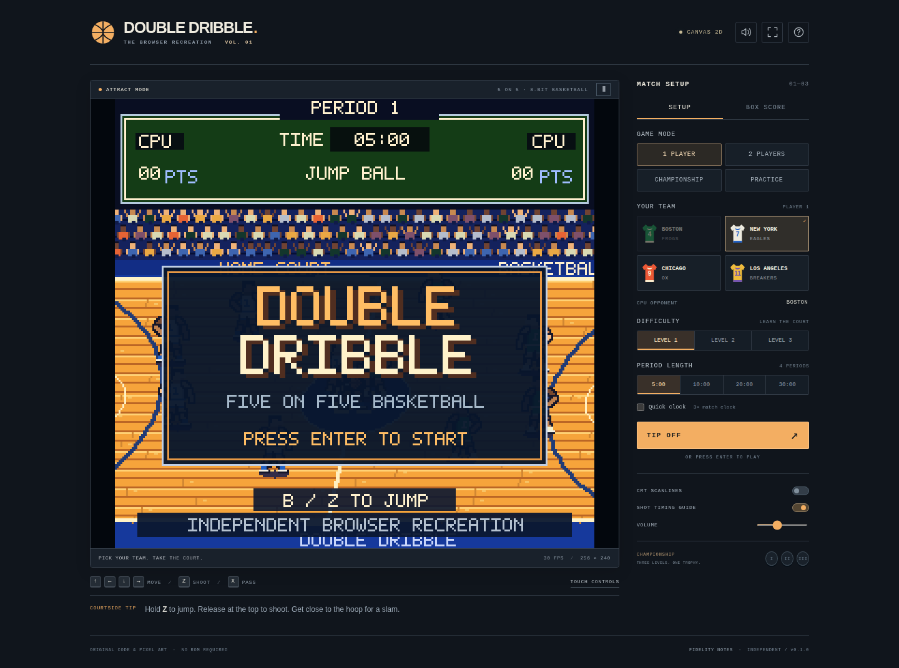

# Double Dribble — browser recreation

**Playable five-on-five pixel basketball in HTML, JavaScript and WebGPU.**

A dependency-free, independently implemented browser game inspired by the NES version of Double Dribble. A fixed-step basketball simulation, original procedural pixel art, an instanced WebGPU renderer, synthesized audio, keyboard/gamepad/touch controls, and local match recovery are separated into reusable modules.

**This is not a pixel-perfect, frame-accurate, or gameplay-perfect reproduction.** It contains no original ROM, extracted graphics, recordings, or emulator. The three CPU levels are implemented, but their exact behavior is reconstructed rather than verified against an original cartridge. See [Fidelity and reference notes](docs/FIDELITY.md) for the exact scope.



## Play

**[Play the hosted game](https://wieslawsoltes.github.io/DoubleDribbleWeb/)** · [Build and deployment](https://github.com/wieslawsoltes/DoubleDribbleWeb/actions)

Open **`dist/double-dribble.html`** for the self-contained version. It embeds all code, styles and procedural assets, so there is nothing to install and no external asset download. Some browsers restrict GPU or local-storage access when opening files directly; use the local server below for a consistent origin.

With **Node.js 20 or newer**, run from this directory:

```sh
npm start
```

Open **http://localhost:8080**. The source version uses native ES modules. WebGPU is attempted automatically; a separately initialized Canvas 2D renderer is used when the GPU API, adapter or initialization is unavailable. The renderer badge identifies the active backend. WebGPU depends on browser support and a secure context; use HTTPS for hosting or localhost for development.

The server binds only to `127.0.0.1`. Select another port using the `PORT` environment variable. It is a development server, not a public production service.

## Controls

| Action | Player 1 | Player 2 |
|---|---|---|
| Move | Arrow keys or W A S D | I J K L |
| Pass / steal / inbound | X | M |
| Jump / shoot / switch defender | Z | N |
| Start / pause / resume | Enter | Enter |

**Hold the shoot button to jump; release near the top to shoot.** Get near the hoop with an open lane to trigger a dunk close-up, then release near the top of that jump. The optional timing guide helps practice the release. Press the shoot button on defense to select the closest defender; when a rebound is available, that player also jumps.

`P` or `Esc` pauses. `F` toggles fullscreen, `H` opens help, and `V` toggles sound. Audio begins only after interaction. Editable setup controls do not consume gameplay keys.

Two standard Gamepad API controllers are supported: D-pad or left stick for movement, button 0 for A/pass/steal, button 1 or 2 for B/shoot/switch, and button 9 for Start. Physical controller labels vary. On small screens, the on-screen joystick and independently captured A/B buttons support simultaneous touch input. The visible A/B labels follow the original controller mapping, not the keyboard letters.

## Included play

- **Single player and local two-player:** four city teams; Boston is the CPU opponent in one-player play. All four teams can be chosen in local versus mode. Three CPU difficulties and 5, 10, 20 or 30-minute periods are available.
- **Full matches:** five active players per team, AI spacing and defense, aimed passes, interceptions, timed shots, dunks, rebounds, shot blocks, inbounds, free throws, two/three-point scoring, period changes, halftime, overtime, a result screen and box scores.
- **Browser additions:** a three-difficulty championship ladder, unlimited practice, optional shot guides and CRT scanlines, a 3× match-clock option, mute/volume, gamepads, touch controls and local save/resume.

The clock runs at 1× by default. Quick clock accelerates only the match clock, not player motion or possession timers. Practice is five-on-zero with an unlimited clock. Championship progression is an added browser mode, not a claim that the original had a three-stage campaign.

Match state is saved to this browser's local storage every five seconds and when pausing or leaving play. The home button saves the current match and returns to the attract screen. **New match replaces the current save.** Saves are local to the origin and browser profile, not cloud-synchronized. Storage failures are nonfatal and reported in the interface; persistence is not guaranteed when storage is disabled or full.

## Architecture

| Module | Responsibility |
|---|---|
| `src/core/game.js` | Renderer-independent fixed-step simulation, state machine, AI, rules, scoring and snapshots |
| `src/core/math.js` | Deterministic random generator, court geometry, teams, difficulty and utility functions |
| `src/render/atlas.js` | Original pixel drawing primitives, bitmap glyphs, court, crowd, players and close-ups |
| `src/render/renderer.js` | WGSL shaders, instanced quad batch, atlas upload, WebGPU initialization and Canvas fallback |
| `src/render/scenes.js` | Court projection, painter ordering, scoreboard, menus and match cinematics |
| `src/input/controls.js` | Keyboard, two gamepads, touch pointer capture and focus handling |
| `src/input/frame-inputs.js` | Button-edge retention across rendering and fixed simulation ticks |
| `src/audio/synth.js` | Original Web Audio tones, effects and simple music |
| `src/storage.js` | Versioned local persistence and recovery |
| `src/main.js` | Application UI, event routing, match lifecycle and frame scheduling |

The simulation runs at **60 fixed steps per simulated second**, independent of display refresh. Button edges are retained until a simulation tick consumes them, including on 120/144 Hz displays. A single procedural texture atlas and a reused instance buffer feed a WebGPU quad batch; the renderer does **not** upload a newly rasterized CPU framebuffer every frame. The logical display is 256 × 240 pixels, scaled with pixel-preserving CSS. The CPU still performs gameplay, art generation at startup, and scene submission; this is not a compute-shader simulation.

Minimal standalone simulation use:

```js
import { BasketballGame } from './src/core/game.js';
import { blankInput } from './src/core/math.js';

const game = new BasketballGame({ mode: 'single', team: 1, level: 2, seed: 198709 });
const playerOne = { ...blankInput(), x: 1 };

game.step(1 / 60, [playerOne, blankInput()]);
for (const event of game.events) {
  // Consume before the next step; route to your audio or interface.
  console.log(event.type);
}
const restored = BasketballGame.restore(game.snapshot());
```

## Build and test

No `npm install` is needed for the build or Node tests.

```sh
npm test          # Simulation, input and storage tests
npm run build     # Rebuild both standalone HTML entry points
npm run check     # Tests and build
```

The build script resolves this project's named relative imports, syntax-checks the resulting classic script, and embeds it and the CSS into `dist/index.html` and `dist/double-dribble.html`. It intentionally is not a general-purpose module bundler.

The optional browser suite uses Python Playwright:

```sh
python -m pip install playwright
python -m playwright install chromium
python tests/browser_smoke.py
```

By default the suite injects the standalone HTML into an opaque `about:blank` context with a documented in-memory storage test double. It verifies Canvas fallback and application behavior without changing browser security policies. To exercise a normally served origin, including native storage and WebGPU when available:

```sh
# Run npm start in another terminal first.
python tests/browser_smoke.py --url 'http://localhost:8080/?test=1'
```

Append `?renderer=canvas` to force Canvas. `?test=1` exposes an opt-in diagnostic hook used by the integration tests. Do not use diagnostics as an authentication or trust boundary.

**Delivery verification:** 59 Node tests and 32 Chromium integration checks pass. The browser checks used Canvas 2D and emulated touch/gamepads; they did not validate physical GPU rendering, physical controllers, mobile hardware, or native browser persistence. See [the full test report](docs/TEST_REPORT.md). Frame-rate counters report observed presentation cadence, not GPU duration or a hardware performance guarantee.

## Hosting

Publish the contents of `dist/` to any static HTTPS host. Everything is relative and self-contained, including deployment under a path prefix. No server-side API, account, analytics, or network multiplayer is present. The GitHub Actions workflow builds and tests every push to `main` and pull request, and publishes the tested `dist/` output to GitHub Pages on `main`. The deployment URL is https://wieslawsoltes.github.io/DoubleDribbleWeb/. For a fork, enable GitHub Pages in **Settings → Pages → Source: GitHub Actions** before running the deployment. The workflow also uploads the standalone game, screenshots and browser test report as downloadable artifacts.

## Attribution and license

Double Dribble is a Konami title. This independent project is not affiliated with or endorsed by Konami or Nintendo. The original implementation and original procedural artwork in this package are licensed under [MIT](LICENSE); this does not grant rights to third-party names, trademarks, ROMs, game assets, or recordings.

The original NES manual was consulted as a reference for controls and the broad ruleset. It is not bundled. Source references and divergences are documented in [FIDELITY.md](docs/FIDELITY.md).
